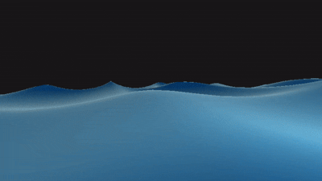
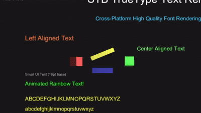

# Open Civilization Game Engine

## Prerequisites
- .NET 9.0 or higher

## Examples

### 1. Rotating Square Example - 2D Quad Color Rendering

### 2. Rotating Cube Example - 3D Lit Shader Rendering

### 3. Ocean Plane - Wave Shader Rendering

### 4. Falling Squares - Physics 2D

### 5. High Quality Text Rendering - Rasterization

